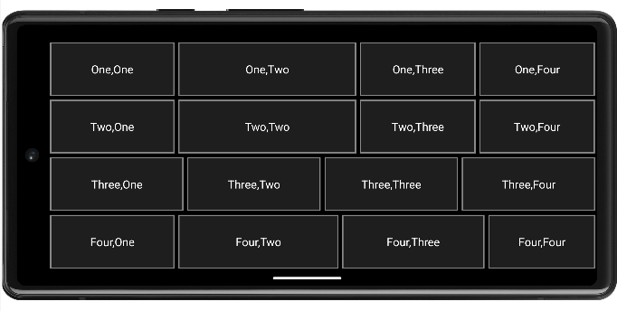
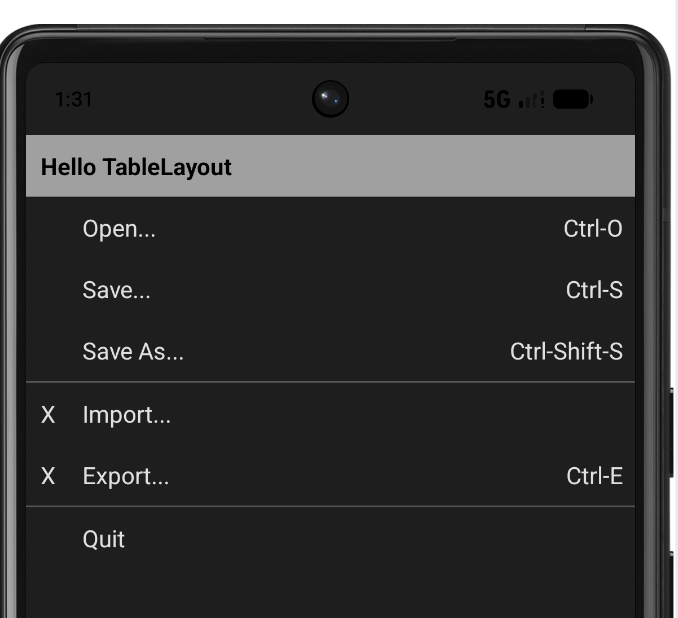
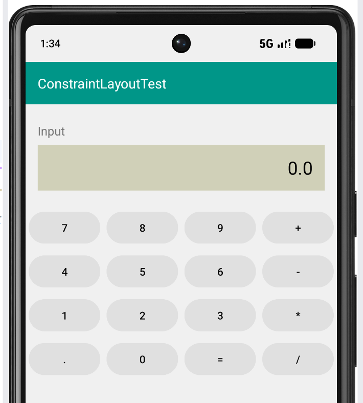
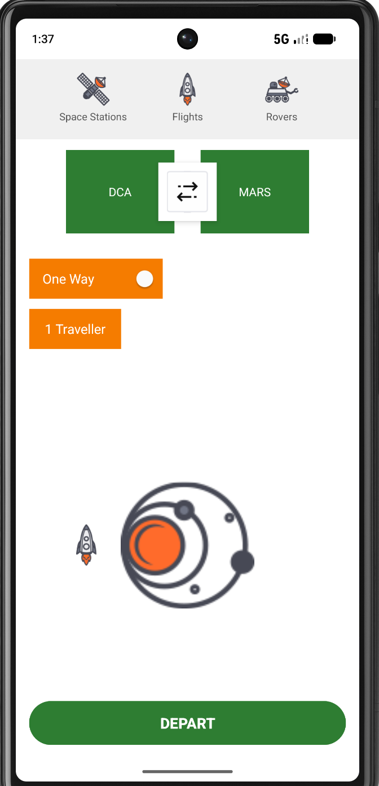
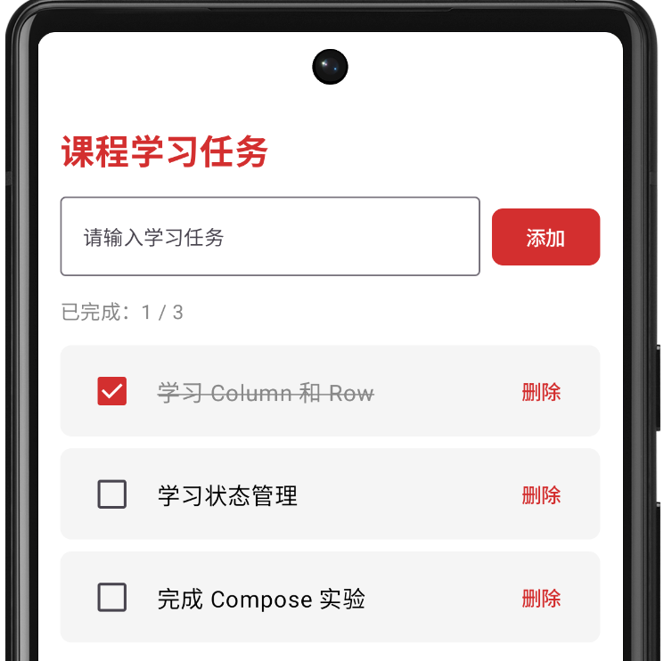
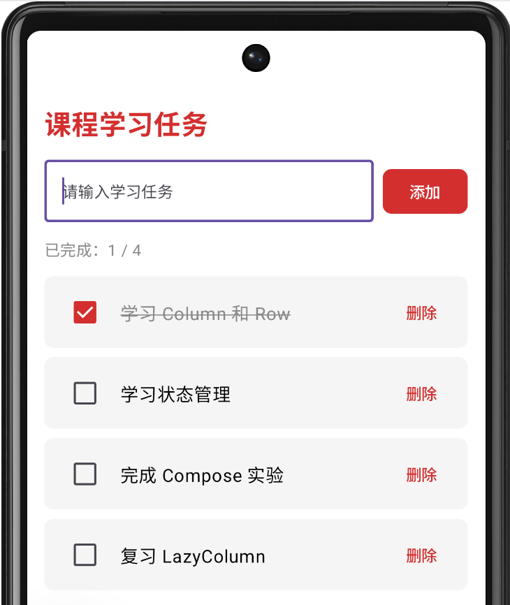
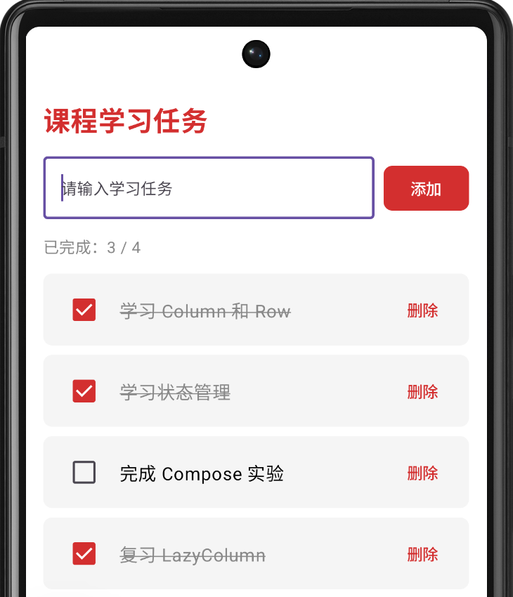

# 实验报告

## 一、实验目的
1. 学习并掌握 Android 中 `ConstraintLayout`（约束布局）、`LinearLayout` （线性布局）和 `TableLayout`（表格布局） 三种传统 XML 布局的基本用法与适用场景。
3. 学习并掌握Compose 声明式 UI 编程思想，理解状态驱动 UI（State Hoisting）的工作原理。
4. 熟练使用 Git 进行版本控制，并将项目托管至 GitHub。

## 二、实验环境
*   **操作系统：** Windows 11
*   **开发工具：** Android Studio
*   **开发语言：** Java (XML部分) / Kotlin (Compose部分)
*   **SDK 版本：** SDK API 24

## 三、实验项目结构
本项目采用单仓库多项目结构进行管理：
*   `Task2Layout/`：包含任务 1~4 的 XML 布局实验。
*   `Task2Compose/`：包含任务 5 的 Jetpack Compose 实验。

---

## 四、实验内容与步骤

### 任务1：利用 LinearLayout 实现 4x4 参差网格
**1. 实验要求**：实现4x4网格，每一行的列宽不一致。
**2. 关键代码**：
在 `activity_linear.xml` 中，通过横向 `LinearLayout` 嵌套 4 个 `TextView`。给每行的 `TextView` 设置不同的 `layout_weight` 比例，并加上 `layout_margin="3dp"` 和自定义的 `cell_border` 灰色描边背景，实现独立卡片效果。

```xml
<!-- 第一行完整代码示例 -->
<LinearLayout
        android:layout_width="match_parent"
        android:layout_height="0dp"
        android:layout_weight="1"
        android:orientation="horizontal">
        <TextView android:layout_width="0dp" 
                  android:layout_height="match_parent" 
                  android:layout_weight="1.4"
                  android:layout_margin="3dp"
                  android:background="@drawable/cell_border"
                  android:gravity="center"
                  android:text="One,One"
                  android:textColor="#FFFFFF"
                  android:textSize="18sp" />
        <TextView android:layout_width="0dp"
                  android:layout_height="match_parent"
                  android:layout_weight="2"
                  android:layout_margin="3dp"
                  android:background="@drawable/cell_border"
                  android:gravity="center"
                  android:text="One,Two"
                  android:textColor="#FFFFFF"
                  android:textSize="18sp" />
        <TextView android:layout_width="0dp"
                  android:layout_height="match_parent"
                  android:layout_weight="1.3"
                  android:layout_margin="3dp"
                  android:background="@drawable/cell_border"
                  android:gravity="center"
                  android:text="One,Three"
                  android:textColor="#FFFFFF"
                  android:textSize="18sp" />
        <TextView android:layout_width="0dp"
                  android:layout_height="match_parent"
                  android:layout_weight="1.3"
                  android:layout_margin="3dp"
                  android:background="@drawable/cell_border"
                  android:gravity="center"
                  android:text="One,Four"
                  android:textColor="#FFFFFF"
                  android:textSize="18sp" />
</LinearLayout>
```
**3. 运行截图**：



*分析：通过计算屏幕宽度的百分比，利用权重大体复刻了原图错落有致的视觉比例。*

### 任务2：利用 TableLayout 实现菜单界面
**1. 实验要求**：实现“Hello TableLayout”多列对齐菜单。
**2. 关键代码**：
在 `activity_table.xml` 中，设置 `android:stretchColumns="1"`，让包含菜单文字的第二列自动拉伸，把快捷键推到最右侧。利用 `layout_span="3"` 让标题横跨3列。使用 `<View>` 标签绘制灰色分割线。

```xml
<TableLayout xmlns:android="http://schemas.android.com/apk/res/android"
    android:layout_width="match_parent"
    android:layout_height="match_parent"
    android:background="#1E1E1E"
    android:stretchColumns="1">

    <!-- 顶部标题横跨3列 -->
    <TextView
        android:layout_span="3"
        android:background="#A0A0A0"
        android:padding="10dp"
        android:text="Hello TableLayout"
        android:textStyle="bold"
        android:textSize="16sp" />

    <!-- 包含 X 标记的菜单项（三列结构） -->
    <TableRow>
        <TextView android:layout_width="30dp" android:gravity="center" android:text="X" />
        <TextView android:text="Import..." />
        <TextView android:gravity="right" android:text="" />
    </TableRow>
</TableLayout>
```
**3. 运行截图**：


### 任务3：利用 ConstraintLayout 实现计算器界面
**1. 实验要求**：实现计算器网格面板。
**2. 关键代码**：
在 `activity_constraint.xml` 中，使用**水平链（Horizontal Chain）**和 `layout_constraintHorizontal_weight="1"` 来均分屏幕宽度。每一行右侧的按钮都加上 `app:layout_constraintTop_toTopOf` 和 `app:layout_constraintBottom_toBottomOf` 约束到该行第一个按钮，保证行内对齐。

```xml
<!-- 第一行完整代码示例 -->
<Button
    android:id="@+id/btn7"
    android:layout_width="0dp"
    android:layout_height="50dp"
    android:layout_marginHorizontal="4dp"
    android:backgroundTint="#E0E0E0"
    android:text="7"
    android:textColor="#000000"
    app:layout_constraintTop_toBottomOf="@id/tvDisplay"
    app:layout_constraintStart_toStartOf="parent"
    app:layout_constraintEnd_toStartOf="@id/btn8"
    app:layout_constraintHorizontal_weight="1"
    app:layout_constraintHorizontal_chainStyle="spread" />

<Button
    android:id="@+id/btn8"
    android:layout_width="0dp"
    android:layout_height="50dp"
    android:layout_marginHorizontal="4dp"
    android:backgroundTint="#E0E0E0"
    android:text="8"
    android:textColor="#000000"
    app:layout_constraintTop_toTopOf="@id/btn7"
    app:layout_constraintBottom_toBottomOf="@id/btn7"
    app:layout_constraintStart_toEndOf="@id/btn7"
    app:layout_constraintEnd_toStartOf="@id/btn9"
    app:layout_constraintHorizontal_weight="1" />
```
**3. 运行截图**：


### 任务4：利用 ConstraintLayout 实现飞船旅行界面
**1. 实验要求**：实现包含 DCA、MARS、箭头重叠的旅行界面。
**2. 关键代码**：
*   **覆盖重叠相交**：在 XML 中把 `ivDoubleArrow` 写在最后，使其层级最高；使用 `android:elevation="4dp"` 确保覆盖。
*   **居中定位**：双向箭头通过 `app:layout_constraintStart_toStartOf="@id/tvDca"` 和 `app:layout_constraintEnd_toEndOf="@id/tvMars"` 实现动态屏幕下绝对居中。

```xml
<!-- DCA方块 -->
<TextView
    android:id="@+id/tvDca"
    android:layout_width="130dp"
    android:layout_height="100dp"
    android:background="#2E7D32"
    android:text="DCA"
    android:textColor="#FFFFFF"
    android:gravity="center"
    android:layout_marginTop="32dp"
    app:layout_constraintTop_toBottomOf="@id/tvStation"
    app:layout_constraintStart_toStartOf="parent" />

<!-- 双向箭头（写在最后，覆盖在最上面） -->
<ImageView
    android:id="@+id/ivArrows"
    android:layout_width="70dp"
    android:layout_height="70dp"
    android:src="@drawable/double_arrows"
    android:background="#FFFFFF"
    android:padding="10dp"
    android:elevation="4dp"
    app:layout_constraintStart_toStartOf="@id/tvDca"
    app:layout_constraintEnd_toEndOf="@id/tvMars"
    app:layout_constraintTop_toTopOf="@id/tvDca"
    app:layout_constraintBottom_toBottomOf="@id/tvDca" />
```
**3. 运行截图**：


### 任务5：利用 Jetpack Compose 实现课程任务列表
**1. 实验要求**：实现任务列表，支持添加、勾选、删除，并实时更新完成数与删除线。
**2. 关键代码**：
在 `MainActivity.kt` 中，使用 `mutableStateListOf` 定义 `Task` 状态列表。利用 `LazyColumn` 和 `itemsIndexed` 渲染列表。通过 `tasks[index] = task.copy(isDone = checked)` 触发 Compose 的自动重组（Recomposition）。

```kotlin
// 定义数据模型
data class Task(
    val id: Int,
    val title: String,
    val isDone: Boolean = false
)

// 状态定义
val tasks = remember {
    mutableStateListOf(
        Task(1, "学习 Column 和 Row", true),
        Task(2, "学习状态管理", false),
        Task(3, "完成 Compose 实验", false)
    )
}

// 列表渲染与状态更新
LazyColumn(modifier = Modifier.fillMaxSize()) {
    itemsIndexed(tasks) { index, task ->
        TaskItem(
            task = task,
            onCheckedChange = { checked ->
                tasks[index] = task.copy(isDone = checked)
            },
            onDelete = {
                tasks.removeAt(index)
            }
        )
    }
}
```
**3. 运行截图**：







---

## 五、实验中遇到的问题与解决（详细代码对比版）

### 问题1：LinearLayout 网格边框合并与文字贴边
**【问题现象】**
任务1中，按照常规写法设置四个 `TextView` 后，预览发现相邻的格子边框融合成了一条细线，且文字紧紧贴着边框，整体像“田字格”，缺乏原图中那种独立卡片和留有黑色缝隙的呼吸感。

**【原本的代码与问题】**
最初在 `activity_linear.xml` 中，让 `TextView` 直接相邻，没有设置任何外边距，且 `cell_border.xml` 只有细描边：
```xml
<!-- 错误写法：TextView之间没有间距 -->
<TextView 
    android:layout_width="0dp" 
    android:layout_height="match_parent" 
    android:layout_weight="1" 
    android:background="@drawable/cell_border" 
    android:gravity="center" 
    android:text="One,One" 
    android:textColor="#FFFFFF" />
```
```xml
<!-- 错误写法：cell_border 只有描边，没有内边距 -->
<?xml version="1.0" encoding="utf-8"?>
<shape xmlns:android="http://schemas.android.com/apk/res/android">
    <solid android:color="#1E1E1E" />
    <stroke android:width="1dp" android:color="#FFFFFF" />
</shape>
```
**导致问题**：相邻的边框重叠，视觉上变成了一条分割线；由于没有 `<padding>`，文字直接贴在最边缘，显得非常局促。

**【修改与解决】**
1. 修改 `cell_border.xml`：加大描边宽度，并加入 `<padding>`，让文字有呼吸空间：
```xml
<?xml version="1.0" encoding="utf-8"?>
<shape xmlns:android="http://schemas.android.com/apk/res/android">
    <solid android:color="#1E1E1E" />
    <stroke android:width="3dp" android:color="#888888" />
    <padding android:left="10dp" android:top="10dp" android:right="10dp" android:bottom="10dp" />
</shape>
```
2. 修改 `activity_linear.xml`：在**每个 `TextView`** 上增加 `android:layout_margin="3dp"`，并给外层 `LinearLayout` 加上黑色背景 `android:background="#000000"`。
```xml
<!-- 正确写法：增加外边距，利用外层黑色背景透出缝隙 -->
<TextView 
    android:layout_width="0dp" 
    android:layout_height="match_parent" 
    android:layout_weight="1" 
    android:layout_margin="3dp"
    android:background="@drawable/cell_border" 
    android:gravity="center" 
    android:text="One,One" 
    android:textColor="#E0E0E0" 
    android:textSize="18sp" />
```
**原理剖析**：`margin` 撑开了相邻控件的物理距离，露出了底层的黑色背景，完美复刻了原图中方块彼此独立、带有黑色间隙的视觉效果。

---

### 问题2：ConstraintLayout 箭头与方块重叠相交失效
**【问题现象】**
任务4中，希望双向箭头浮在 DCA 和 MARS 中间。最初的代码尝试用 `-20dp` 的负边距让方块向中间延伸，但要么没有相交，要么在屏幕变宽时整个布局发生了严重的挤压和错位。

**【原本的代码与问题】**
最初尝试让 DCA 和 MARS 宽度设为 `0dp` 强制拉伸，配合负边距去覆盖箭头：
```xml
<!-- 错误写法：使用 0dp 拉伸配合负边距 -->
<TextView 
    android:id="@+id/tvDca" 
    android:layout_width="0dp" 
    android:layout_height="100dp" 
    android:layout_marginEnd="-20dp"
    android:background="#2E7D32" 
    android:text="DCA" 
    app:layout_constraintStart_toStartOf="parent" 
    app:layout_constraintEnd_toStartOf="@id/ivArrows" />
```
**导致问题**：在 ConstraintLayout 中，使用 `0dp`（Match Constraint）会引发空间分配竞争。当系统尝试计算可用空间时，负边距会被“吞掉”，导致箭头被挤压变形，或者方块直接覆盖掉箭头。

**【修改与解决】**
放弃 `0dp` 和复杂的负边距覆盖，改为**固定宽度 + 锚定居中 + 提升Z轴层级**：
1. 将 DCA 和 MARS 的宽度固定为 `130dp`（不再使用 0dp 拉伸）。
2. 让双向箭头通过双向约束绝对居中：左侧锚定到 DCA，右侧锚定到 MARS。
```xml
<!-- 正确写法：箭头作为锚点居中，并提升Z轴层级 -->
<ImageView
    android:id="@+id/ivArrows"
    android:layout_width="70dp"
    android:layout_height="70dp"
    android:src="@drawable/double_arrows"
    android:background="#FFFFFF"
    android:padding="10dp"
    android:elevation="4dp" 
    app:layout_constraintStart_toStartOf="@id/tvDca"
    app:layout_constraintEnd_toEndOf="@id/tvMars"
    app:layout_constraintTop_toTopOf="@id/tvDca"
    app:layout_constraintBottom_toBottomOf="@id/tvDca" />
```
3. 最后，在 XML 中**将 `ivArrows` 的代码写在 DCA 和 MARS 之后**，并添加 `android:elevation="4dp"`，确保其渲染层级最高。

**原理剖析**：`layout_constraintStart_toStartOf` 和 `End_toEndOf` 相当于把箭头的左右边界“钉”在了两个方块的边缘，系统会自动计算屏幕宽度并让箭头永远居中。配合 `elevation` 和代码顺序，箭头自然就盖在了方块上方，实现了完美的相交效果。

---

### 问题3：Android 15 沉浸式状态栏遮挡顶部布局
**【问题现象】**
在较新的模拟器（Android 15 / API 35）上运行 TableLayout 界面时，最顶部的 "Hello TableLayout" 被手机的状态栏（时间、电量）直接遮挡，导致看不见。

**【原本的代码与问题】**
根布局直接开始写内容，没有任何避让系统栏的处理：
```xml
<!-- 错误写法：没有避让系统栏 -->
<TableLayout xmlns:android="http://schemas.android.com/apk/res/android"
    android:layout_width="match_parent"
    android:layout_height="match_parent"
    android:background="#1E1E1E"
    android:stretchColumns="1">
```
**导致问题**：Android 15 开始强制开启了沉浸式（Edge-to-Edge）显示模式，应用内容默认会延伸到状态栏下方，导致顶部内容被系统图标盖住。

**【修改与解决】**
在根布局中加入 `android:fitsSystemWindows="true"` 属性：
```xml
<!-- 正确写法：给系统状态栏预留空间 -->
<TableLayout xmlns:android="http://schemas.android.com/apk/res/android"
    android:layout_width="match_parent"
    android:layout_height="match_parent"
    android:fitsSystemWindows="true"
    android:background="#1E1E1E"
    android:stretchColumns="1">
```
**原理剖析**：`fitsSystemWindows="true"` 会告诉系统：“请给我的布局顶部留出状态栏高度作为内边距（Padding）”。这样布局整体就会自动下移，避开状态栏。

---

### 问题4：Compose 列表状态更新无效（数据未驱动UI）
**【问题现象】**
任务5中，点击复选框后，虽然代码里写了 `task.isDone = true`，但界面没有任何反应，删除线不出现，顶部“已完成：1/3”的计数也不改变。

**【原本的代码与问题】**
最初使用了普通的 `List` 或直接修改对象属性：
```kotlin
// 错误写法：普通 List 无法被 Compose 观测到
val tasks = remember { listOf(Task(1, "学习 Column 和 Row", false)) } 
// 错误写法：直接修改对象内部属性，Compose 无法察觉
tasks[0].isDone = true 
```
**导致问题**：Compose 是声明式 UI，它只对“状态（State）”的变化有反应。普通的 `listOf` 是不可变的，修改它不会触发重组；直接修改对象属性也不会产生新的对象引用，Compose 无法感知数据发生变化。

**【修改与解决】**
改用 `mutableStateListOf`，并通过 `.copy()` 替换整个对象，从而触发 Compose 的自动重组：
```kotlin
// 正确写法：定义数据类
data class Task(
    val id: Int,
    val title: String,
    val isDone: Boolean = false
)

// 正确写法：使用 mutableStateListOf
val tasks = remember {
    mutableStateListOf(
        Task(1, "学习 Column 和 Row", true),
        Task(2, "学习状态管理", false),
        Task(3, "完成 Compose 实验", false)
    )
}

// 正确写法：在 Checkbox 的 onCheckedChange 中替换整个对象，触发状态更新
Checkbox(
    checked = task.isDone,
    onCheckedChange = { checked ->
        tasks[index] = task.copy(isDone = checked)
    },
    colors = CheckboxDefaults.colors(checkedColor = Color(0xFFD32F2F))
)
```
**原理剖析**：`mutableStateListOf` 会向 Compose 注册观察者。当内部元素被替换时（`task.copy` 生成了一个新的对象），Compose 框架检测到数据改变，自动重新执行（Recompose）相关的 UI 代码，从而驱动界面刷新。

---

## 六、实验总结
本次实验覆盖了 Android 传统 View 体系与 Jetpack Compose 两大 UI 开发范式。通过前四个 XML 任务，我熟悉了 LinearLayout 的权重分配、TableLayout 的表格对齐以及 ConstraintLayout 的强大约束链条。在最后 Compose 任务中，我深刻体会到了声明式 UI “状态驱动视图”的便捷性，不再需要手动去 `findViewById` 并操作控件属性。此外，在 Git 版本控制的过程中，也锻炼了自己解决网络故障与身份认证问题的能力。
